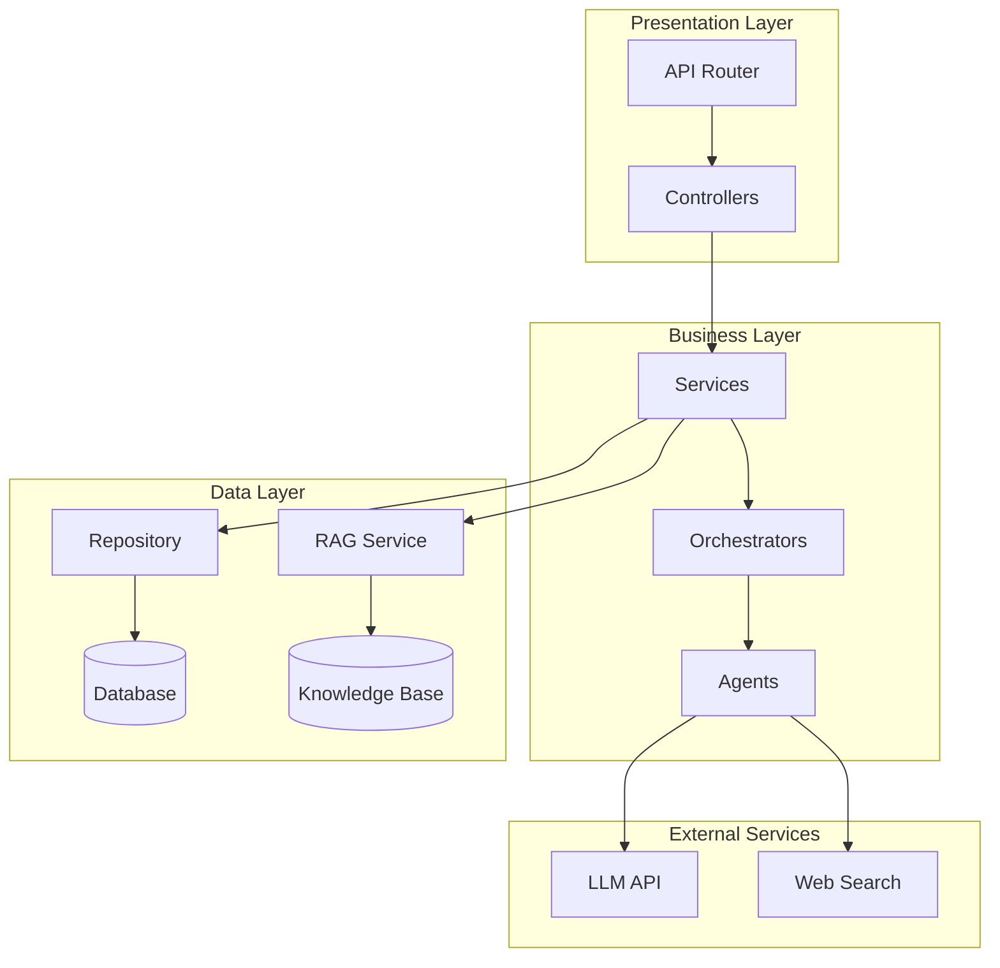
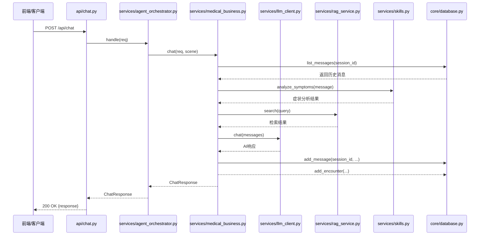
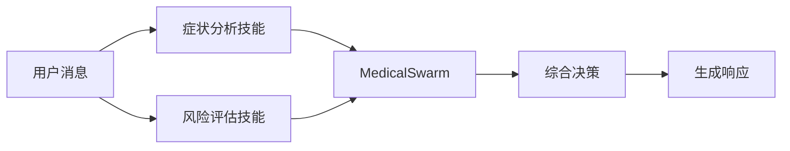
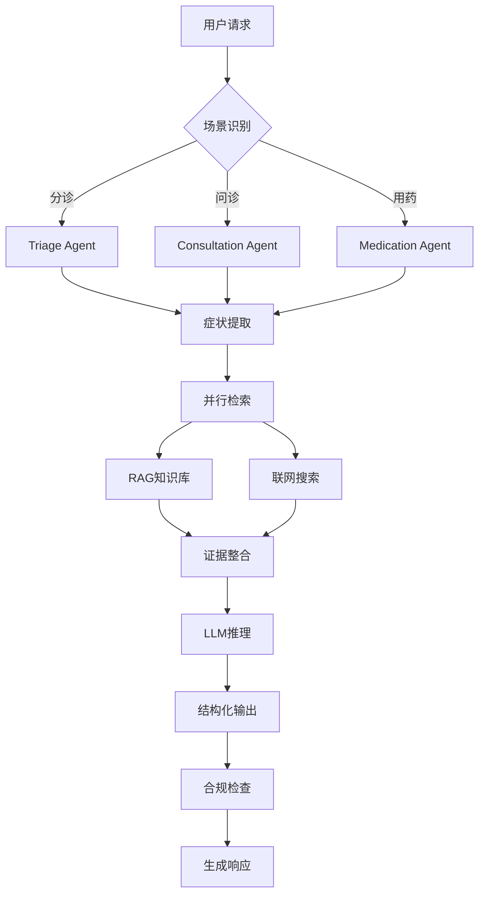
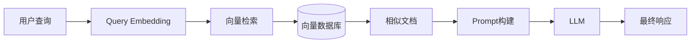

# 医路通 AI 后端项目学习指南

> 面向 Python 编程基础学习者的系统化教学文档

---

## 📚 文档说明

本指南旨在帮助具备 Python 核心语法基础但无 FastAPI 框架经验的学习者，通过循序渐进的模块化教学，系统掌握医路通 AI 后端项目的开发技能。

### 学习路径规划

| 阶段 | 模块 | 预计学时 |
|------|------|----------|
| 基础准备 | 开发环境配置 | 2小时 |
| 框架入门 | FastAPI核心概念 | 4小时 |
| 架构理解 | 项目架构设计 | 3小时 |
| 核心实现 | 功能模块开发 | 6小时 |
| AI进阶 | Skill/Agent/RAG技术 | 8小时 |
| 测试部署 | 测试与依赖管理 | 4小时 |

---

## 1️⃣ 开发环境配置

### 学习目标
- 掌握 Python 虚拟环境的创建与管理
- 熟悉 VS Code 配置 Python 开发环境
- 了解 Git 版本控制基础操作

### 1.1 Python 版本要求

本项目要求 Python 3.8 及以上版本。推荐使用 Python 3.10+。

```bash
# 检查 Python 版本
python --version  # Windows
python3 --version # macOS/Linux
```

### 1.2 虚拟环境创建与激活

**Windows 系统：**
```powershell
# 创建虚拟环境
python -m venv venv

# 激活虚拟环境
venv\Scripts\activate

# 退出虚拟环境
deactivate
```

**macOS/Linux 系统：**
```bash
# 创建虚拟环境
python3 -m venv venv

# 激活虚拟环境
source venv/bin/activate

# 退出虚拟环境
deactivate
```

### 1.3 VS Code 配置

1. **安装 Python 插件**
   - 打开 VS Code，搜索并安装 "Python" 插件（Microsoft 官方）

2. **配置解释器**
   - 按 `Ctrl+Shift+P` 打开命令面板
   - 输入 "Python: Select Interpreter"
   - 选择虚拟环境中的 Python 解释器（`.venv/Scripts/python.exe`）

3. **代码格式化**
   - 安装 `black` 格式化工具：`pip install black`
   - 在 `.vscode/settings.json` 中配置：
   ```json
   {
       "python.formatting.provider": "black",
       "editor.formatOnSave": true
   }
   ```

### 1.4 Git 版本控制基础

```bash
# 克隆仓库
git clone <repository-url>

# 创建分支
git checkout -b feature/my-feature

# 添加文件
git add .

# 提交更改（遵循 Angular 规范）
git commit -m "feat: 添加用户登录功能"

# 推送分支
git push origin feature/my-feature

# 拉取最新代码
git pull origin main
```

### 🎯 实践练习

**任务：** 创建一个名为 `practice_env` 的虚拟环境，激活后安装 `fastapi` 和 `uvicorn`。

**完成标准：**
1. 成功创建虚拟环境
2. 激活后命令行显示 `(practice_env)` 前缀
3. 执行 `pip list` 能看到 fastapi 和 uvicorn

---

## 2️⃣ FastAPI 核心概念与应用

### 学习目标
- 理解 HTTP 协议基础
- 掌握 FastAPI 路由定义
- 学会使用 Pydantic 进行数据验证
- 理解依赖注入机制

### 2.1 HTTP 协议基础

**请求方法：**
| 方法 | 用途 | 幂等性 |
|------|------|--------|
| GET | 获取资源 | 是 |
| POST | 创建资源 | 否 |
| PUT | 更新资源 | 是 |
| DELETE | 删除资源 | 是 |

**常见状态码：**
- 200 OK - 请求成功
- 201 Created - 资源创建成功
- 400 Bad Request - 请求参数错误
- 404 Not Found - 资源未找到
- 500 Internal Server Error - 服务器内部错误

### 2.2 路由定义

**基础路由示例：**
```python
from fastapi import FastAPI

app = FastAPI(title="医路通 AI", version="2.1.0")

# GET 请求
@app.get("/api/health")
async def health_check():
    """健康检查接口"""
    return {"status": "ok", "service": "medical-agent"}

# POST 请求
@app.post("/api/chat")
async def chat(message: str):
    """简单聊天接口"""
    return {"response": f"收到消息: {message}"}
```

**路径参数：**
```python
@app.get("/api/sessions/{session_id}")
async def get_session(session_id: str):
    """根据会话ID获取会话信息"""
    return {"session_id": session_id, "status": "active"}
```

**查询参数：**
```python
@app.get("/api/messages")
async def get_messages(session_id: str, limit: int = 20):
    """获取会话消息列表"""
    return {"session_id": session_id, "limit": limit, "messages": []}
```

### 2.3 请求体与 Pydantic 模型

```python
from pydantic import BaseModel, Field
from typing import Optional

class PatientContext(BaseModel):
    """患者上下文信息模型"""
    age: Optional[int] = None
    gender: Optional[str] = None
    chronic_diseases: Optional[str] = None
    allergy_history: Optional[str] = None
    medication_history: Optional[str] = None

class ChatRequest(BaseModel):
    """聊天请求模型"""
    message: str = Field(..., min_length=1, description="用户输入消息")
    session_id: Optional[str] = None
    user_id: str = "demo_user"
    patient_context: PatientContext = Field(default_factory=PatientContext)

@app.post("/api/chat")
async def chat(req: ChatRequest):
    """处理聊天请求"""
    return {
        "session_id": req.session_id,
        "user_message": req.message,
        "patient_age": req.patient_context.age
    }
```

### 2.4 依赖注入

```python
from fastapi import Depends

async def get_db_connection():
    """获取数据库连接（依赖项）"""
    conn = sqlite3.connect("example.db")
    try:
        yield conn
    finally:
        conn.close()

@app.get("/api/sessions")
async def list_sessions(db=Depends(get_db_connection)):
    """查询会话列表，依赖数据库连接"""
    cursor = db.execute("SELECT * FROM sessions")
    return cursor.fetchall()
```

### 2.5 实际项目示例

查看项目中的路由定义：`backend/app/api/chat.py`

```python
from fastapi import APIRouter
from app.schemas.chat import ChatRequest, ChatResponse
from app.services.agent_orchestrator import MedicalAgentOrchestrator

router = APIRouter(prefix="/api", tags=["chat"])
orchestrator = MedicalAgentOrchestrator()

@router.post("/chat", response_model=ChatResponse)
async def chat(req: ChatRequest):
    """处理用户聊天请求"""
    return await orchestrator.handle(req)
```

### 🧪 知识检验

**选择题：**
1. 以下哪个不是 HTTP 幂等方法？
   - A. GET
   - B. POST
   - C. PUT
   - D. DELETE

2. FastAPI 中定义路径参数的正确方式是？
   - A. `@app.get("/users?id={user_id}")`
   - B. `@app.get("/users/{user_id}")`
   - C. `@app.get("/users?user_id={user_id}")`
   - D. `@app.get("/users", params={"user_id"})`

**答案：** 1.B  2.B

---

## 3️⃣ 项目架构设计

### 学习目标
- 理解分层架构思想
- 掌握项目目录结构设计原则
- 了解各模块职责划分

### 3.1 分层架构思想（Controller-Service-Repository）



### 3.2 项目目录结构

```
backend/
├── app/                          # 应用核心代码
│   ├── api/                      # API 路由层（Controller）
│   │   ├── __init__.py
│   │   ├── chat.py               # 聊天接口
│   │   ├── metrics.py            # 指标接口
│   │   └── platform.py           # 平台接口
│   ├── core/                     # 核心配置与工具
│   │   ├── __init__.py
│   │   ├── config.py             # 配置管理
│   │   └── database.py           # 数据库操作
│   ├── schemas/                  # 数据模型（Pydantic）
│   │   ├── __init__.py
│   │   └── chat.py               # 聊天相关模型
│   ├── services/                 # 业务逻辑层（Service）
│   │   ├── __init__.py
│   │   ├── agent_orchestrator.py # Agent编排器
│   │   ├── medical_business.py   # 医疗业务核心
│   │   ├── llm_client.py         # LLM客户端
│   │   ├── rag_service.py        # RAG服务
│   │   ├── skills.py             # 技能模块
│   │   └── deep_search.py        # 深度搜索
│   └── __init__.py
├── config/                       # 配置文件
│   └── config.yaml               # 应用配置
├── skills/                       # 技能定义目录
│   ├── symptom_analysis/
│   ├── risk_assessment/
│   └── ...
├── main.py                       # 应用入口
└── requirements.txt              # 依赖列表
```

### 3.3 模块职责划分

| 模块 | 职责 | 关键文件 |
|------|------|----------|
| **api** | 处理 HTTP 请求，路由分发 | `chat.py`, `platform.py` |
| **schemas** | 数据结构定义，请求/响应验证 | `chat.py` |
| **services** | 业务逻辑实现，核心处理 | `medical_business.py`, `rag_service.py` |
| **core** | 基础设施，配置与数据库 | `config.py`, `database.py` |
| **skills** | 技能注册与管理 | 各技能目录下的 SKILL.md |

### 3.4 模块间交互关系



### 🎯 实践练习

**任务：** 绘制一个完整的请求流程图，展示从客户端请求 `/api/sessions/{session_id}/messages` 到返回响应的完整流程。

---

## 4️⃣ 核心功能模块实现

### 学习目标
- 掌握需求分析方法
- 学会设计 RESTful API
- 理解核心业务逻辑实现

### 4.1 聊天功能模块

#### 需求分析

| 需求点 | 描述 |
|--------|------|
| 用户消息发送 | 用户通过前端发送文本消息 |
| 会话管理 | 支持多会话，保持上下文 |
| AI 响应生成 | 调用 LLM 生成医疗建议 |
| 证据检索 | 从知识库检索相关信息 |
| 风险评估 | 判断症状风险等级 |

#### 接口设计

| API 路径 | 方法 | 功能 |
|----------|------|------|
| `/api/chat` | POST | 发送聊天消息 |
| `/api/sessions` | GET | 获取会话列表 |
| `/api/sessions/{id}/messages` | GET | 获取会话消息 |
| `/api/sessions/{id}` | DELETE | 删除会话 |

**POST /api/chat 请求体：**
```json
{
    "message": "我最近有点头痛",
    "session_id": "abc123",
    "user_id": "demo_user",
    "patient_context": {
        "age": 26,
        "gender": "男",
        "chronic_diseases": "高血压",
        "allergy_history": "青霉素",
        "medication_history": "布洛芬"
    }
}
```

**响应格式：**
```json
{
    "session_id": "abc123",
    "answer": "根据您的症状...",
    "risk_level": "低风险",
    "suggestions": ["建议休息", "避免劳累"],
    "recommended_department": "内科",
    "thinking_steps": ["分析症状", "检索证据"],
    "disclaimer": "以上内容仅用于健康科普...",
    "evidence": [],
    "agent_trace": [],
    "metrics": {}
}
```

#### 代码实现

**核心流程 - MedicalSwarm.run()**（简化版）：

```python
async def run(self, scene, message, patient, history):
    # 1. 症状分析
    symptom_profile = analyze_symptoms(message)
    risk_hint = assess_risk(message)
    
    # 2. 并行检索（本地RAG + 联网搜索）
    local_task = asyncio.to_thread(self.rag.search, query, 6)
    web_task = web_search(query, limit=3, timeout=6.0)
    local_evidence, web_evidence = await asyncio.gather(local_task, web_task)
    
    # 3. LLM推理
    structured = await self._reason_with_llm(
        scene=scene,
        message=message,
        patient=patient,
        evidence=local_evidence + web_evidence,
        ...
    )
    
    # 4. 合规检查
    answer = compliance_guard(answer)
    
    return SwarmResult(...)
```

### 4.2 报告查询与解读模块

#### 需求分析
- 查询患者检验/检查报告列表
- AI 解读报告异常项
- 给出就医建议

#### 接口设计

| API 路径 | 方法 | 功能 |
|----------|------|------|
| `/api/platform/reports` | GET | 获取报告列表 |
| `/api/platform/reports/{id}/interpret` | POST | AI解读报告 |

#### 代码实现

```python
async def interpret_report(report_id: str) -> Dict[str, Any]:
    """解读检验报告"""
    report = next((item for item in REPORTS if item["id"] == report_id), None)
    if not report:
        return {"id": report_id, "analysis": "未查询到该报告。"}
    
    # 识别异常项
    abnormal = [item for item in report["items"] if item["flag"] != "正常"]
    
    # 推荐科室
    department = "呼吸科" if "胸" in report["name"] else "内科"
    risk_level = "中风险" if abnormal else "低风险"
    
    # LLM解读（或降级模式）
    if llm.enabled:
        text = await llm.chat([...])
    else:
        text = report_fallback(report, abnormal, department)
    
    return {"id": report_id, "department": department, "analysis": text}
```

### 4.3 预约挂号模块

#### 需求分析
- 查询科室排班
- 预约挂号
- 取消预约
- 查询预约记录

#### 接口设计

| API 路径 | 方法 | 功能 |
|----------|------|------|
| `/api/platform/schedule` | GET | 查询科室排班 |
| `/api/platform/appointment` | POST | 创建预约 |
| `/api/platform/appointment/{id}` | DELETE | 取消预约 |
| `/api/platform/appointments` | GET | 查询预约列表 |

### 🧪 知识检验

**代码改错题：**

```python
# 找出并修复以下代码中的错误
from fastapi import FastAPI
from pydantic import BaseModel

app = FastAPI()

class User(BaseModel):
    name: str
    age: str  # 错误1：年龄应该是整数

@app.get("/users")
def get_user(user_id):  # 错误2：缺少类型注解
    return {"user_id": user_id}

@app.post("/users")
async def create_user(user: User):
    return {"message": f"User {user.name} created", "age": user.age + 1}  # 错误3：字符串不能直接加整数
```

---

## 5️⃣ 依赖管理

### 学习目标
- 理解 requirements.txt 的作用
- 掌握 pip 工具使用方法
- 了解依赖版本控制策略

### 5.1 requirements.txt 文件

本项目的依赖列表：

```txt
fastapi==0.115.6           # Web框架
uvicorn[standard]==0.34.0  # ASGI服务器
pydantic==2.10.4          # 数据验证
pyyaml==6.0.2             # YAML解析
openai==1.59.7            # OpenAI SDK
duckduckgo-search==6.3.7  # 联网搜索
python-multipart==0.0.20  # 文件上传支持
```

### 5.2 pip 工具使用

```bash
# 安装依赖
pip install -r requirements.txt

# 安装特定版本
pip install fastapi==0.115.6

# 升级依赖
pip install --upgrade fastapi

# 卸载依赖
pip uninstall fastapi

# 查看已安装依赖
pip list

# 导出当前环境依赖
pip freeze > requirements.txt

# 安装开发依赖
pip install pytest pytest-asyncio httpx  # 测试相关
```

### 5.3 版本控制策略

| 版本规范 | 示例 | 说明 |
|----------|------|------|
| 固定版本 | `==1.0.0` | 精确匹配，稳定性高 |
| 大于等于 | `>=1.0.0` | 兼容更新 |
| 小于 | `<2.0.0` | 防止重大变更 |
| 兼容版本 | `~=1.0.0` | 等价于 `>=1.0.0,<1.1.0` |
| 任意版本 | `fastapi` | 安装最新版本（不推荐） |

### 5.4 虚拟环境依赖管理

```bash
# 创建虚拟环境
python -m venv venv

# 激活
source venv/bin/activate  # Linux/macOS
venv\Scripts\activate     # Windows

# 安装依赖
pip install -r requirements.txt

# 导出依赖
pip freeze > requirements.txt

# 复制环境到其他机器
# 1. 复制 requirements.txt
# 2. 在目标机器创建虚拟环境并安装
```

### 🎯 实践练习

**任务：** 
1. 创建虚拟环境
2. 安装项目依赖
3. 添加 `pytest` 和 `httpx` 作为开发依赖
4. 导出新的 requirements.txt

---

## 6️⃣ 测试方法

### 学习目标
- 理解单元测试和接口测试概念
- 掌握 pytest 框架使用
- 学会设计测试用例

### 6.1 测试类型概述

| 测试类型 | 测试对象 | 目的 |
|----------|----------|------|
| 单元测试 | 单个函数/方法 | 验证独立功能正确性 |
| 接口测试 | API 端点 | 验证接口行为符合预期 |
| 集成测试 | 多个模块协作 | 验证模块间交互 |

### 6.2 pytest 框架基础

**安装 pytest：**
```bash
pip install pytest pytest-asyncio httpx
```

**测试文件结构：**
```
backend/
├── tests/
│   ├── __init__.py
│   ├── test_chat.py      # 聊天接口测试
│   ├── test_skills.py    # 技能模块测试
│   └── test_rag.py       # RAG服务测试
└── pytest.ini            # pytest配置
```

**pytest.ini 配置：**
```ini
[pytest]
testpaths = tests
asyncio_mode = auto
python_files = test_*.py
```

### 6.3 单元测试示例

```python
# tests/test_skills.py
import pytest
from app.services.skills import analyze_symptoms, assess_risk

def test_analyze_symptoms():
    """测试症状分析函数"""
    result = analyze_symptoms("我最近有点头痛和发烧")
    
    assert "头痛" in result["symptoms"]
    assert "发热" in result["symptoms"]
    assert result["body_system"] == "神经系统"

def test_assess_risk_high():
    """测试高风险症状识别"""
    result = assess_risk("我胸痛难忍，呼吸困难")
    
    assert result["risk_level"] == "高风险"
    assert "紧急处理" in result["advice"]

def test_assess_risk_low():
    """测试低风险症状识别"""
    result = assess_risk("我有点轻微感冒")
    
    assert result["risk_level"] == "低风险"
```

### 6.4 接口测试示例

```python
# tests/test_chat.py
import pytest
from fastapi.testclient import TestClient
from main import app

client = TestClient(app)

def test_health_endpoint():
    """测试健康检查接口"""
    response = client.get("/api/health")
    assert response.status_code == 200
    assert response.json() == {"status": "ok"}

def test_chat_endpoint():
    """测试聊天接口"""
    payload = {
        "message": "我头痛",
        "patient_context": {"age": 26, "gender": "男"}
    }
    response = client.post("/api/chat", json=payload)
    
    assert response.status_code == 200
    data = response.json()
    assert "session_id" in data
    assert "answer" in data
    assert "risk_level" in data
```

### 6.5 参数化测试

```python
@pytest.mark.parametrize("symptom,expected_system", [
    ("胸痛", "心血管系统"),
    ("咳嗽", "呼吸系统"),
    ("腹痛", "消化系统"),
    ("头痛", "神经系统"),
])
def test_body_system_detection(symptom, expected_system):
    """参数化测试身体系统识别"""
    result = analyze_symptoms(symptom)
    assert result["body_system"] == expected_system
```

### 6.6 测试覆盖率

```bash
# 安装 coverage
pip install coverage

# 运行测试并生成覆盖率报告
coverage run -m pytest tests/
coverage report -m

# 生成 HTML 报告
coverage html
```

**覆盖率目标：**
- 核心业务逻辑：≥80%
- 工具函数：≥90%
- API 接口：≥70%

### 🧪 知识检验

**简答题：**
1. 单元测试和接口测试的区别是什么？
2. 什么是参数化测试？它的优点是什么？
3. 为什么需要测试覆盖率？

---

## 7️⃣ AI 相关核心组件

### 学习目标
- 理解 Skill 模块设计
- 掌握 Agent 架构
- 了解 RAG 技术原理

### 7.1 Skill 模块

#### 技能定义规范

```python
# 技能函数结构
def skill_function(input_data: dict) -> dict:
    """
    技能功能描述
    
    参数：
        input_data: 输入数据字典
    
    返回：
        dict: 输出结果
    """
    # 处理逻辑
    return {"result": ...}
```

**项目中的技能示例（skills.py）：**

```python
def analyze_symptoms(question: str) -> Dict:
    """症状分析技能：识别用户描述中的症状和所属身体系统"""
    symptoms = []
    for word in HIGH_RISK_KEYWORDS + MEDIUM_RISK_KEYWORDS:
        if word in question:
            symptoms.append(word)
    
    body_system = "全科"
    if any(w in question for w in ["胸痛", "心慌"]):
        body_system = "心血管系统"
    # ... 其他系统判断
    
    return {"symptoms": symptoms, "body_system": body_system}

def assess_risk(question: str) -> Dict:
    """风险评估技能：根据症状判断风险等级"""
    if any(word in question for word in HIGH_RISK_KEYWORDS):
        return {"risk_level": "高风险", "advice": "建议立即线下就医"}
    # ... 中低风险判断
```

#### 技能调用流程



#### 技能扩展方法

**添加新技能步骤：**
1. 在 `services/skills.py` 中定义技能函数
2. 在 `services/medical_business.py` 中调用新技能
3. 更新测试用例

### 7.2 Agent 模块

#### 智能体架构设计

**MedicalSwarm 核心组件：**

```python
class MedicalSwarm:
    """AI-first Swarm runtime: RAG + DeepResearch + structured medical reasoning."""
    
    def __init__(self):
        self.rag = RAGService()      # RAG检索服务
        self.llm = LLMClient()       # LLM客户端
    
    async def run(self, scene, message, patient, history):
        # 1. 症状分析
        symptom_profile = analyze_symptoms(message)
        
        # 2. 并行检索
        local_task = asyncio.to_thread(self.rag.search, query, 6)
        web_task = web_search(query, limit=3, timeout=6.0)
        
        # 3. LLM推理
        structured = await self._reason_with_llm(...)
        
        # 4. 合规检查
        answer = compliance_guard(answer)
```

#### 决策流程



#### 状态管理

```python
# 会话状态维护（database.py）
def upsert_session(session_id: str, title: str = "医疗问诊会话") -> None:
    """创建或更新会话记录"""
    ts = now_text()
    with get_conn() as conn:
        conn.execute(
            """
            INSERT INTO sessions(id, title, created_at, updated_at)
            VALUES (?, ?, ?, ?)
            ON CONFLICT(id) DO UPDATE SET updated_at=excluded.updated_at
            """,
            (session_id, title, ts, ts),
        )
        conn.commit()

def add_message(session_id: str, role: str, content: str, metadata=None) -> None:
    """添加消息到会话"""
    with get_conn() as conn:
        conn.execute(
            "INSERT INTO messages(session_id, role, content, metadata, created_at) VALUES (?, ?, ?, ?, ?)",
            (session_id, role, content, json.dumps(metadata or {}), now_text()),
        )
        conn.commit()
```

### 7.3 RAG 技术

#### 检索增强生成原理



#### 知识库构建

```python
class RAGService:
    def __init__(self):
        self.knowledge_dir = Path(SETTINGS["rag"]["knowledge_dir"])
        self.documents = self._load_docs()
    
    def _load_docs(self) -> List[Dict]:
        """加载知识库文档"""
        docs = []
        for path in self.knowledge_dir.glob("*.md"):
            text = path.read_text(encoding="utf-8")
            title = text.splitlines()[0].replace("#", "").strip()
            
            # 文本分割
            chunks = [chunk.strip() for chunk in re.split(r"\n#{2,3}\s+", text) if chunk.strip()]
            
            for idx, chunk in enumerate(chunks):
                docs.append({
                    "source": path.name,
                    "title": title,
                    "content": chunk[:1600],
                    "tokens": Counter(tokenize(chunk)),  # 词频向量化
                })
        return docs
```

#### 检索策略实现

```python
def search(self, query: str, top_k: int = None) -> List[Evidence]:
    """基于余弦相似度的检索"""
    q = Counter(tokenize(query))
    if not q:
        return []
    
    results = []
    q_norm = math.sqrt(sum(v * v for v in q.values()))  # 查询向量归一化
    
    for doc in self.documents:
        # 计算余弦相似度
        dot = sum(q[t] * doc["tokens"].get(t, 0) for t in q)
        d_norm = math.sqrt(sum(v * v for v in doc["tokens"].values())) or 1
        score = dot / (q_norm * d_norm or 1)
        
        if score > 0:
            results.append(Evidence(
                source=doc["source"],
                title=doc["title"],
                score=round(float(score), 4),
                content=doc["content"],
            ))
    
    results.sort(key=lambda x: x.score, reverse=True)
    return results[:top_k or self.top_k]
```

### 🎯 实践练习

**任务：** 添加一个新的技能函数 `get_medical_advice(symptoms: list) -> dict`，根据症状列表返回健康建议。

**完成标准：**
1. 在 `services/skills.py` 中实现函数
2. 在 `services/medical_business.py` 中调用该函数
3. 编写测试用例验证功能

---

## 📝 附录

### A. 常用命令汇总

```bash
# 启动开发服务器
cd backend
python -m uvicorn main:app --reload --host 0.0.0.0 --port 8012

# 运行测试
pytest tests/ -v

# 生成测试覆盖率报告
coverage run -m pytest tests/
coverage report -m

# 安装依赖
pip install -r requirements.txt

# 查看 API 文档
# 启动服务后访问: http://localhost:8012/docs
```

### B. 项目配置说明

配置文件位置：`backend/config/config.yaml`

| 配置项 | 说明 | 默认值 |
|--------|------|--------|
| llm.api_key | LLM API密钥 | - |
| llm.base_url | API基础地址 | - |
| llm.model_name | 模型名称 | qwen-plus |
| server.host | 服务地址 | 127.0.0.1 |
| server.port | 服务端口 | 8012 |
| rag.knowledge_dir | 知识库目录 | ../data/knowledge_base |
| features.enable_llm | 是否启用LLM | true |

### C. 参考资源

- [FastAPI 官方文档](https://fastapi.tiangolo.com/)
- [Pydantic 文档](https://docs.pydantic.dev/)
- [pytest 文档](https://docs.pytest.org/)
- [RAG 技术入门](https://arxiv.org/abs/2301.13379)

---

> 📌 **文档版本**: v2.1.0  
> 📅 **更新日期**: 2026年5月  
> 📁 **项目地址**: [医路通 AI 后端项目]

---

**声明**：本学习指南仅用于教学目的，所有医疗相关内容仅供健康科普和就医参考，不能替代专业医生的诊断和治疗。