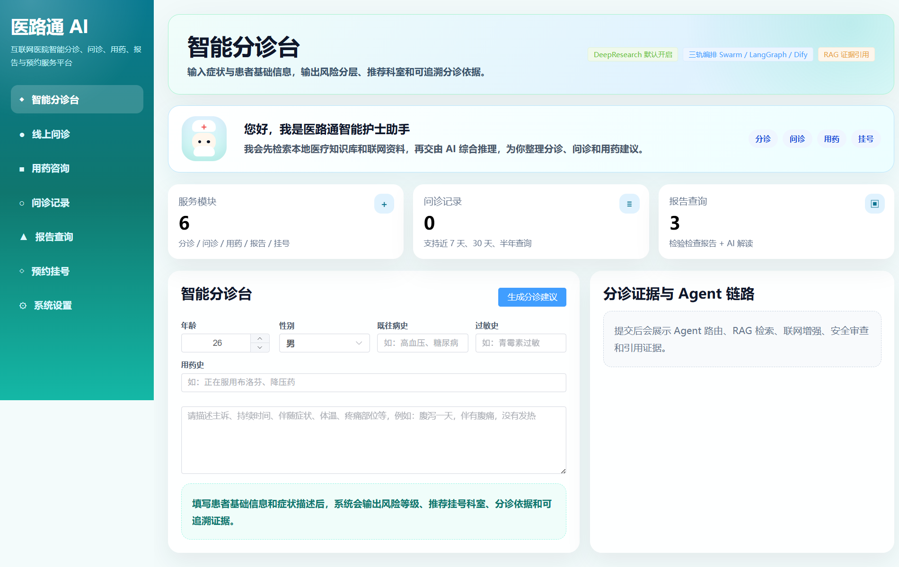
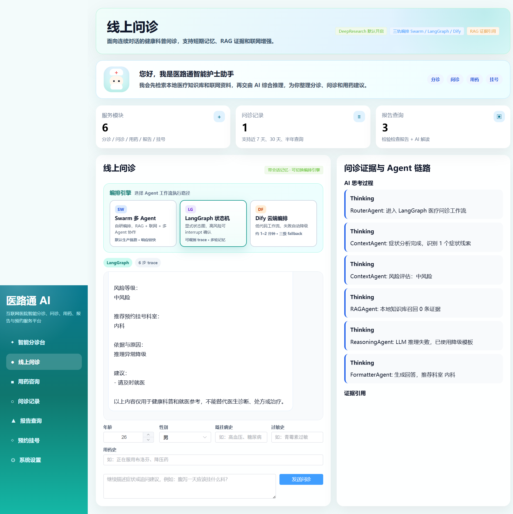
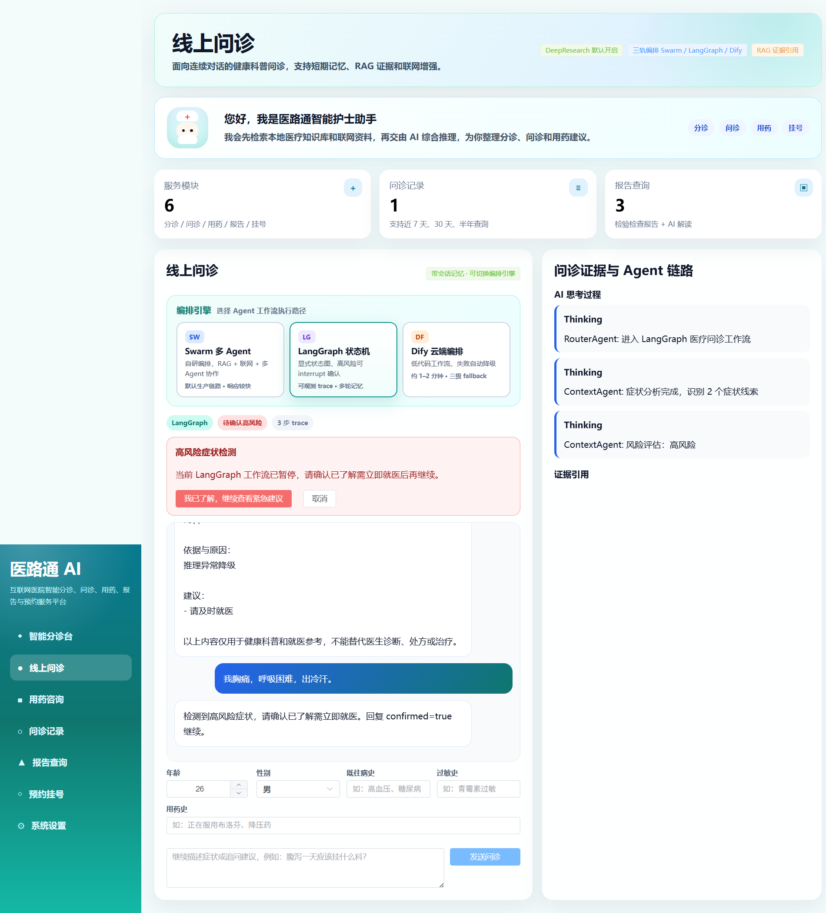
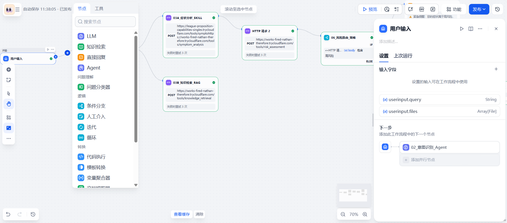
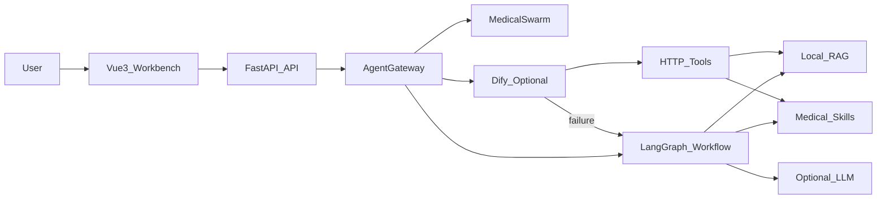

# 医路通 AI 医疗 Agent 工作台

医路通是一个面向学习、技术探索和开源贡献的医疗 Agent 项目。它把 FastAPI 后端、Vue3 工作台、LangGraph 状态机、Dify 可选编排、RAG 医学知识库、规则 Skills、SQLite 会话记忆和医疗合规边界整合到一个可本地复现的演示系统中。

> 免责声明：本项目仅用于健康科普、预问诊流程和 AI 工程实践展示，不能替代医生诊断、处方或治疗。请不要将本项目用于真实医疗决策。

## 亮点

- **多编排后端**：统一网关支持 Swarm、LangGraph、Dify 三种路径，Dify 失败时自动降级到 LangGraph，再兜底到 Swarm。
- **LangGraph 状态机**：覆盖症状分析、风险评估、RAG 召回、LLM 推理、格式化输出和高风险 human-in-the-loop interrupt/resume。
- **Dify 可选增强**：本地 Skills 通过 HTTP tools 暴露给 Dify，便于在 Dify 画布上搭建可配置工作流。
- **离线可运行**：不配置真实 LLM 或 Dify 时，仍可使用本地规则 + RAG 知识库完成核心问诊演示。
- **可观测体验**：前端展示 agent trace、thinking steps、fallback 状态、风险等级和推荐科室。
- **开源友好**：提供测试、Docker、CI、配置样例和完整文档，适合开发者快速上手和二次开发。

## 界面预览

| 工作台首页 | LangGraph Trace |
| --- | --- |
|  |  |

| 高风险 Interrupt | Dify 工作流（可选） |
| --- | --- |
|  |  |

## 快速演示要点

1. 前端切换 **LangGraph**，展示显式状态机 trace 与 thinking steps。
2. 发送普通问诊，演示本地规则 + RAG + 可选 LLM 的降级链路。
3. 发送高风险症状，展示 interrupt/resume 的人机协同安全边界。
4. 说明 Dify 是可选编排层，失败时自动 fallback 到 LangGraph。
5. 强调医疗合规：不确诊、不开处方、保留免责声明。

## 架构



核心文件：

- `backend/app/services/langgraph_workflow.py`：LangGraph 医疗问诊状态机。
- `backend/app/services/agent_gateway.py`：Swarm / LangGraph / Dify 统一编排网关。
- `backend/app/services/dify_tools.py`：Dify HTTP tools。
- `backend/app/services/medical_business.py`：传统 Swarm 业务链路和回答渲染。
- `frontend/src/App.vue`：Vue3 医疗工作台。
- `data/knowledge_base/`：本地 Markdown 医学知识库。

## 快速启动

### 1. 后端

```bash
cd backend
python -m venv .venv
.venv\Scripts\activate
pip install -r requirements.txt
python main.py
```

macOS / Linux:

```bash
cd backend
python -m venv .venv
source .venv/bin/activate
pip install -r requirements.txt
python main.py
```

健康检查：

```text
http://127.0.0.1:8012/api/health
```

### 2. 前端

```bash
cd frontend
npm install
npm run dev
```

访问：

```text
http://127.0.0.1:5178
```

## 配置

后端默认读取 `backend/config.example.yaml`，如果存在 `backend/config/config.yaml` 会优先读取本地私有配置。环境变量可放在 `backend/.env`，参考 `backend/.env.example`。

默认配置不启用真实 LLM，也不要求 Dify，因此首次启动无需 API Key。

启用真实 LLM：

```env
MEDIX_API_KEY=your-api-key
MEDIX_ENABLE_LLM=true
```

启用 Dify 可选链路：

```env
DIFY_API_KEY=app-xxxx
DIFY_APP_ID=your-app-id
DIFY_API_URL=https://api.dify.ai/v1
DIFY_TIMEOUT=90
```

前端默认连接 `http://127.0.0.1:8012`。如需修改：

```env
VITE_API_BASE=http://127.0.0.1:8012
```

## 常用命令

```bash
# 后端单元/集成测试
cd backend
python -m pytest -q

# 前端构建检查
cd frontend
npm install
npm run build

# 本地 E2E 检查，跳过真实 Dify 外部链路
cd backend
python scripts/check_e2e.py --skip-dify
```

## Docker 演示

```bash
docker compose up --build
```

服务地址：

- 前端：`http://127.0.0.1:5178`
- 后端：`http://127.0.0.1:8012/api/health`

## Dify 说明

Dify 在本项目中是可选增强，不是本地演示的前置条件。推荐先跑通 LangGraph 本地链路，再按 `docs/dify-demo/ENTERPRISE_WORKFLOW.md` 将 `/tools/*` HTTP tools 接入 Dify 画布。

参考工作流应用（需登录 Dify Cloud）：

- Studio: https://cloud.dify.ai/app/d2051109-a79b-468a-8b98-73eeed4d745e/workflow

如需要让 Dify 访问本地后端，可使用 `backend/scripts/start_tunnel.ps1` 或 `backend/scripts/start_tunnel.sh` 启动公网隧道，并把当前隧道地址填入 Dify HTTP 节点。截图中的 tunnel URL 会随本地隧道变化，公开仓库不应提交个人 `.env` 或长期有效的密钥。

## 安全边界

- 本项目默认面向本地 demo。公开部署前请配置 CORS、反向代理、HTTPS、访问鉴权和限流。
- 可通过 `DIFY_TOOL_TOKEN` 为 `/tools/*` 增加共享密钥校验。
- 可通过 `ADMIN_API_TOKEN` 为清空会话等演示管理接口增加共享密钥校验。
- LangGraph 当前使用内存 checkpoint，进程重启后 interrupt 状态会丢失；生产环境应替换为持久化 checkpoint。

## 文档

- `docs/ARCHITECTURE.md`：架构和请求链路说明。
- `docs/DEPLOYMENT.md`：Docker、本地部署和公开部署注意事项。
- `docs/DEMO.md`：演示脚本和截图清单。
- `docs/dify-demo/ENTERPRISE_WORKFLOW.md`：Dify 企业感工作流搭建指南。

## License

MIT License. See `LICENSE`.
