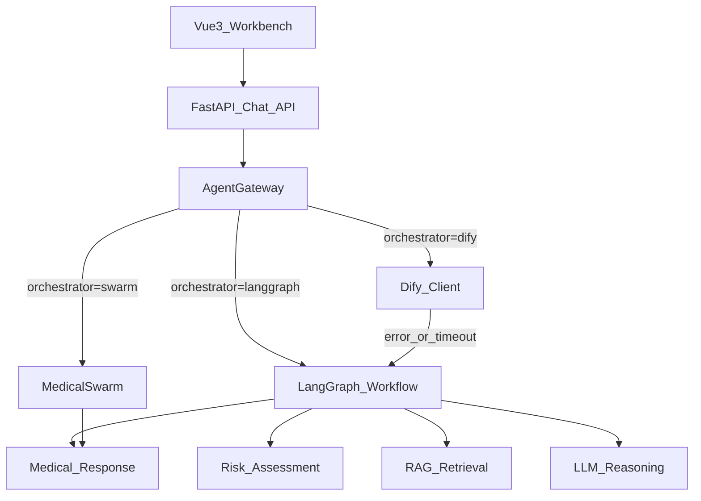

# Architecture

doctor-Agent is organized as a local-first medical Agent demo with optional cloud orchestration.

## Request Flow



## Backend Modules

- `backend/app/api/chat.py`: public chat routes and LangGraph resume/state endpoints.
- `backend/app/services/agent_gateway.py`: routes requests to Swarm, LangGraph, or Dify and applies fallback.
- `backend/app/services/langgraph_workflow.py`: explicit graph workflow with `MedicalState`, conditional routing, RAG, LLM, and high-risk interrupts.
- `backend/app/services/dify_tools.py`: local HTTP tools that Dify can call through a tunnel.
- `backend/app/services/rag_service.py`: local Markdown knowledge retrieval.
- `backend/app/services/skills.py`: deterministic symptom, risk, lifestyle, and compliance helpers.
- `backend/app/core/database.py`: SQLite-backed demo sessions, messages, encounters, and appointments.

## Orchestrator Strategy

The default local path is LangGraph because it is reproducible without external services and exposes execution trace. Dify is treated as an optional cloud orchestration layer for visual workflow demos.

Fallback order:

```text
Dify -> LangGraph -> Swarm
```

This keeps the app usable when Dify is not configured, when the tunnel URL expires, or when external calls time out.

## Safety Boundaries

The system is an educational demo. It applies several safety layers:

- high-risk keyword detection before normal answer generation;
- LangGraph interrupt/resume for emergency symptoms;
- answer rendering with medical disclaimer;
- compliance guard for unsafe wording;
- local RAG evidence instead of unrestricted generation when LLM is disabled.

These are not sufficient for production medical use. A production system would need clinical review, audit logging, rate limiting, authentication, persistent LangGraph checkpoints, and regulated deployment controls.
